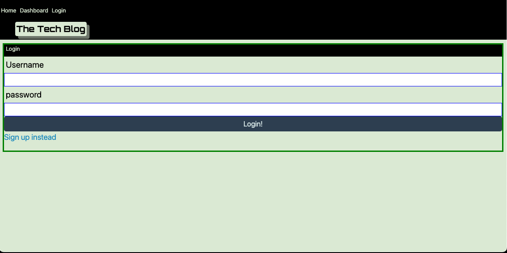

# # cmsblog

CMS Blog
Model-View-Controller (MVC)

## Author

Mark Edwards

## Deployment

[Live](https://github.com/mark-227-g/cmsblog)

## User Story

```md
AS A developer who writes about tech
I WANT a CMS-style blog site
SO THAT I can publish articles, blog posts, and my thoughts and opinions
```

## Acceptance Criteria

```md
GIVEN a CMS-style blog site
WHEN I visit the site for the first time
THEN I am presented with the homepage, which includes existing blog posts if any have been posted; navigation links for the homepage and the dashboard; and the option to log in
WHEN I click on the homepage option
THEN I am taken to the homepage
WHEN I click on any other links in the navigation
THEN I am prompted to either sign up or sign in
WHEN I choose to sign up
THEN I am prompted to create a username and password
WHEN I click on the sign-up button
THEN my user credentials are saved and I am logged into the site
WHEN I revisit the site at a later time and choose to sign in
THEN I am prompted to enter my username and password
WHEN I am signed in to the site
THEN I see navigation links for the homepage, the dashboard, and the option to log out
WHEN I click on the homepage option in the navigation
THEN I am taken to the homepage and presented with existing blog posts that include the post title and the date created
WHEN I click on an existing blog post
THEN I am presented with the post title, contents, post creator’s username, and date created for that post and have the option to leave a comment
WHEN I enter a comment and click on the submit button while signed in
THEN the comment is saved and the post is updated to display the comment, the comment creator’s username, and the date created
WHEN I click on the dashboard option in the navigation
THEN I am taken to the dashboard and presented with any blog posts I have already created and the option to add a new blog post
WHEN I click on the button to add a new blog post
THEN I am prompted to enter both a title and contents for my blog post
WHEN I click on the button to create a new blog post
THEN the title and contents of my post are saved and I am taken back to an updated dashboard with my new blog post
WHEN I click on one of my existing posts in the dashboard
THEN I am able to delete or update my post and taken back to an updated dashboard
WHEN I click on the logout option in the navigation
THEN I am signed out of the site
WHEN I am idle on the site for more than a set time
THEN I am able to view posts and comments but I am prompted to log in again before I can add, update, or delete posts
```

## Installation

To install and run the StellarWatch application locally, follow these steps:

1. Clone the repository to your local machine.
2. Install the dependencies by running the following command in the terminal: npm install
3. Create a MySQL database for the application.
4. Update the database configuration in the `.env` file with your MySQL credentials.
5. Create the database using schema.sql and then createdb.sql
6. Seed the database by running the following command in the terminal: node seeds/index.js
7. Start the application by running the following command in the terminal: npm start
8. Open your web browser and access the application at `http://127.0.0.1:3001/login`

### screenshots

* 

* 

* 

* 

## Technology used

* HTML5
* CSS3
* Javascript
* jQuery
* node.js
* Express.js
* MySQL
* Bcrupt
* Sequelize
* Handlebars
* Bootstrap
* font awesome
* Deployed using github pages
* Deployed using heroku

## References

* [W3schools](https://www.w3schools.com/html/html5_semantic_elements.asp)
* [jQuery](https://jqueryui.com)
* [handlebars](https://handlebarsjs.com)
* [Sequelize](https://sequelize.org)
* [Bootstrap](https://getbootstrap.com/)
* [mdn Developer Resources](https://developer.mozilla.org/en-US/)
* [fontawesome](https://fontawesome.com/)

Many of the MVC components are based on a astronomical project [Stellarwatch](https://github.com/mark-227-g/stellarwatch).
Credit should be noted for my teammates for this Stellarwatch project.

* Mark Edwards: [mark-227-g](https://github.com/mark-227-g)
* Zach Berger: [berman619](https://github.com/berman619)
* Damil Canales: [dcanales8](https://github.com/dcanales8)  

## License

This project is licensed under the terms of the [MIT](https://opensource.org/licenses/MIT) license.

## Contributing

Contributions to CMS Blog are welcome! If you would like to contribute to this project, please follow these guidelines:

Fork the repository

* Create a new branch for your feature or improvement.
* Commit your changes and push your branch to your forked repository.
* Submit a pull request describing your changes.
